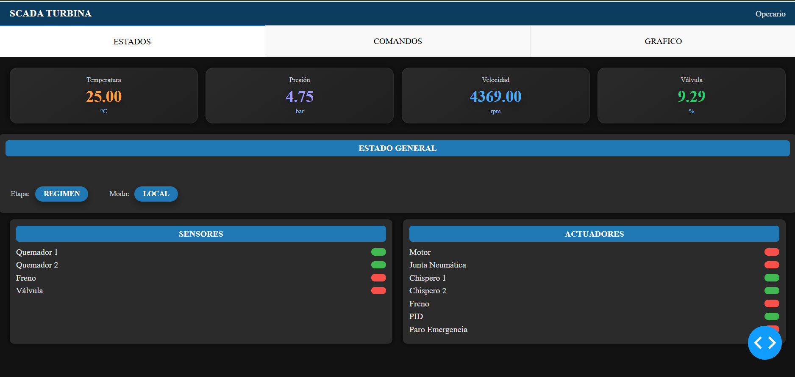
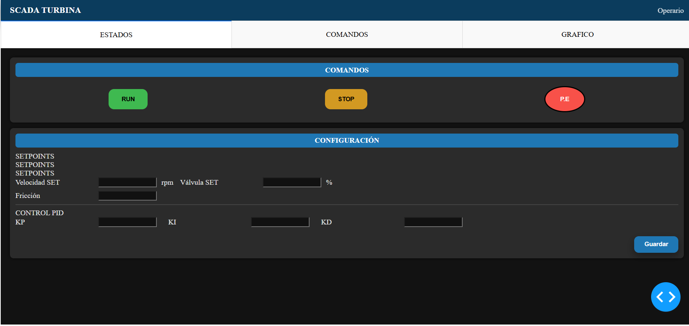
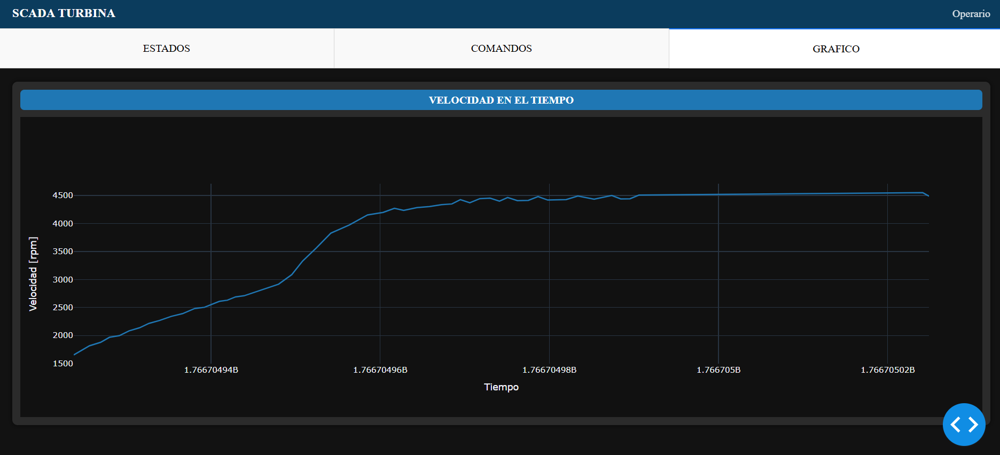

# 🏭 SCADA Turbina – Industria 4.0 (Python + Dash)

Sistema **SCADA educativo–industrial** desarrollado en Python que simula y controla una **turbina de gas**, integrando:

- Modelo dinámico del proceso
- Control PID industrial
- Interfaz SCADA moderna (Dash)
- Comunicación bidireccional en tiempo real
- Arquitectura modular y escalable

> Proyecto orientado a **Industria 4.0**, automatización industrial y control de procesos.

---

## 🚀 Características principales

✔️ Simulación realista de una turbina  
✔️ Control PID con anti-windup y derivada filtrada  
✔️ SCADA web en tiempo real (Dash / Plotly)  
✔️ Manejo de estados: arranque, aceleración, régimen, paro  
✔️ Paro de emergencia (local / remoto)  
✔️ Visualización de sensores y actuadores  
✔️ Arquitectura desacoplada (proceso ↔ SCADA)  

---

## 🖥️ Capturas del SCADA

### Vista general – Estados del proceso


### Comandos y configuración


### Gráfico de velocidad


---

## 🧠 Arquitectura del sistema

```
main.py
 ├─ Hilo de simulación del proceso
 ├─ Comunicación mediante Queues
 └─ Lanzamiento del SCADA (Dash)

Componentes.py
 └─ Modelo dinámico de la turbina

ControlPID.py
 └─ Controlador PID industrial

dashboard/
 ├─ Dashboard.py   → callbacks y lógica Dash
 ├─ layout.py      → estructura visual
 ├─ components.py  → componentes reutilizables
 └─ styles.css     → estilos personalizados
```

---

## 🔁 Comunicación SCADA ↔ Proceso

La comunicación se realiza mediante **colas (`multiprocessing.Queue`)**:

- `accion_queue` → comandos desde el SCADA al proceso
- `data_queue` → estados del proceso hacia el SCADA

Esto garantiza:
- Desacople total
- Seguridad de hilos
- Escalabilidad futura (PLC, MQTT, OPC UA, etc.)

---

## 🧪 Control PID

El controlador PID incluye:

- ✔️ Modo MAN / AUTO
- ✔️ Anti-windup (back-calculation)
- ✔️ Derivada filtrada
- ✔️ Saturación de salida
- ✔️ Implementación discreta industrial

Archivo: `ControlPID.py`

---

## 🛑 Seguridad y protecciones

El sistema contempla:

- Paro de emergencia local y remoto
- Protección por sobretemperatura
- Estados seguros de actuadores
- Bloqueo automático ante fallas críticas

---

## ▶️ Ejecución del proyecto

### Requisitos
- Python 3.10+
- Dash
- Plotly

Instalar dependencias:
```bash
pip install dash plotly
```

Ejecutar:
```bash
python main.py
```

Abrir navegador en:
```
http://127.0.0.1:8050
```

---

## 🎯 Objetivo del proyecto

Este proyecto fue desarrollado con fines:

- 🎓 Educativos (Universidad / Tecnicatura)
- 🏭 Industriales (Industria 4.0)
- 🧠 Didácticos (SCADA + Control + Simulación)

Sirve como base para:
- Integración con PLC
- Migración a OPC UA / MQTT
- Gemelo digital
- Sistemas HMI reales

---

## 📌 Posibles mejoras futuras

- Integración con PLC real
- Control por temperatura
- Alarmas y eventos históricos
- Registro de datos (historiador)
- Autenticación de usuarios
- Dockerización

---

## 👨‍💻 Autor

**Carlos Nicolás Oviedo Codigoni**  
Ingeniería / Automatización / Programación  
Docente Universitario – Programación & Control  
Argentina 🇦🇷  

---

## 📄 Licencia

Proyecto de uso educativo y demostrativo.  
Libre para estudio, modificación y mejora.
